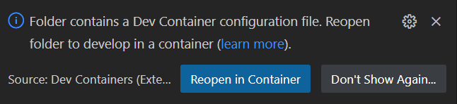

# Start Tensorflow Dev Container

We gaan een (tensorflow/tensorflow:latest-jupyter) docker container starten en hierin ontwikkelen in python met vscode op de lokale desktop.

Benodigd zijn vs code (met de extention: Visual Studio Code Dev Containers)

1. Open de folder "beeld" in vscode, rechts onderin verschijnt nu de melding:
 

2. Kies "Reopen in Container"

vs code is nu gestart en verbonden met de docker container. Als het goed is gestart in de folder "/workspaces/vrolijkevrijdag012023/beeld/home" welke gedeeld is als docker volume.

3. Je kunt beginnen met het lezen en uitvoeren van de jupiter notebooks in het mapje basics om de basics van tensorflow te leren.

4. In de folder image_class is een voorbeeld van het classificeren van images uitgelegd. Het eindresultaat is een tensorflow model.
